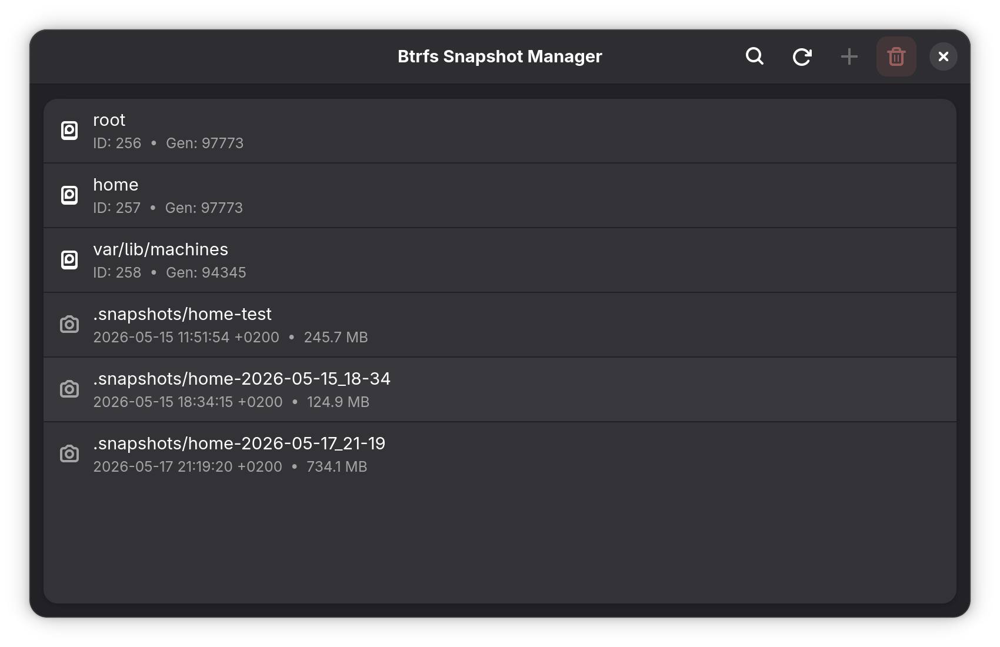
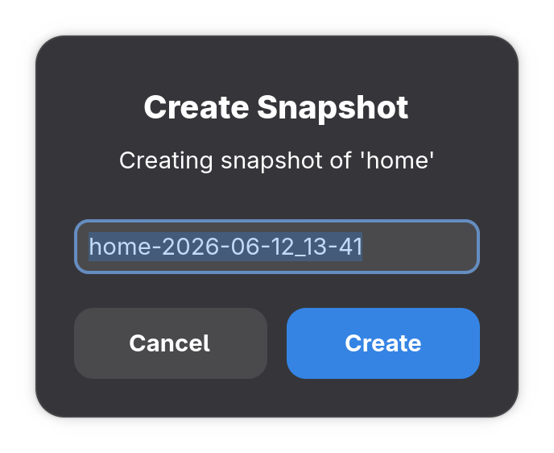
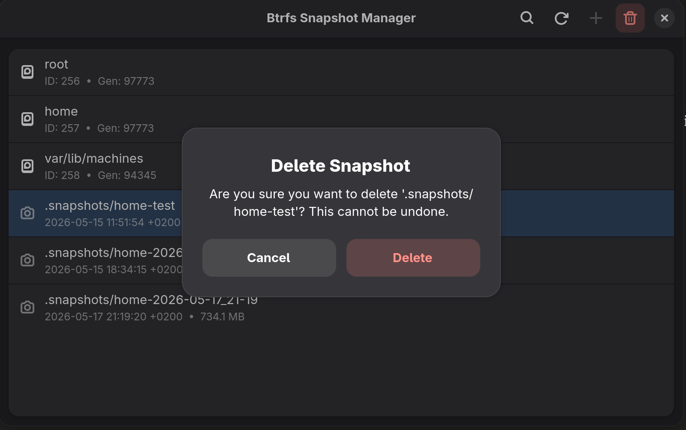
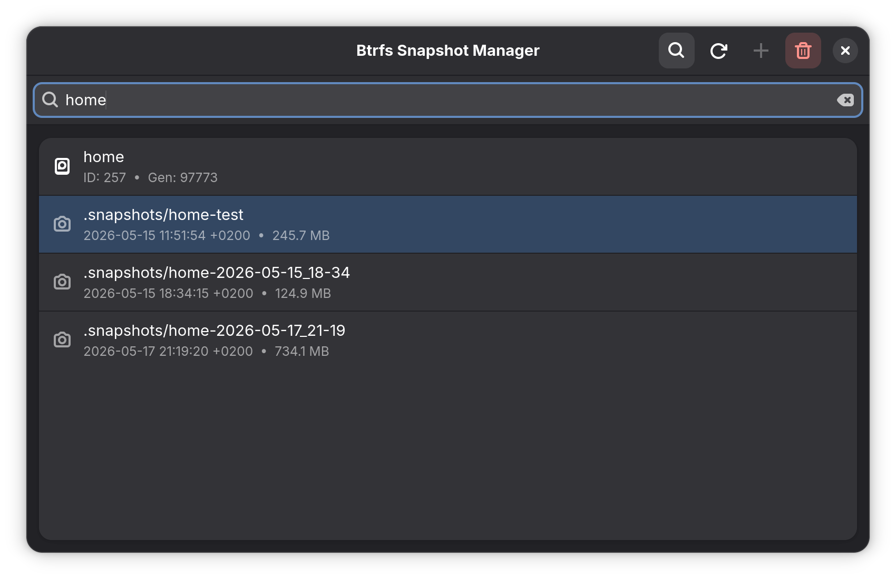

# Btrfs Snapshot Manager

A GTK4 desktop application to manage Btrfs snapshots visually on Linux.
Built with Python and libadwaita for native GNOME integration.



## 🚀 Features

- **List subvolumes and snapshots** with icons distinguishing each type
- **Create snapshots** with an editable, auto-generated default name
- **Delete snapshots** with a confirmation dialog
- **Search/filter** subvolumes and snapshots by name
- **Snapshot metadata** — creation date and exclusive disk size
- **Native execution** — runs seamlessly Btrfs operations via automated `sudoers.d` policies
- **Empty and error states** with native GNOME styling

## 📸 Screenshots

| Create snapshot | Delete snapshot | Search |
|---|---|---|
|  |  |  |

## 🛠️ Prerequisites

- Linux with a Btrfs root filesystem
- Btrfs quotas enabled for size reporting:

```bash
sudo btrfs quota enable /
```

## ⚙️ Installation

The recommended way to install Btrfs Snapshot Manager on Fedora/RHEL-based systems is via the RPM package. The RPM automatically installs all required dependencies (GTK4, libadwaita, etc.), sets up the desktop entry, and configures a specific `sudoers.d` rule so the app can manage snapshots without prompting for a password.


### Install from Release (recommended)

Download the latest `.rpm` from the [Releases page](https://github.com/lagunamanuel/btrfs-snapshot-manager/releases) and install:

```bash
sudo dnf install ./btrfs-snapshot-manager-1.0-1.fc44.noarch.rpm
```

Once installed, launch **Btrfs Snapshot Manager** directly from your GNOME application grid.

### Build from source

```bash
sudo dnf install rpm-build rpmdevtools
git clone https://github.com/lagunamanuel/btrfs-snapshot-manager
cd btrfs-snapshot-manager
mkdir -p ~/rpmbuild/SOURCES
tar czf ~/rpmbuild/SOURCES/btrfs-snapshot-manager-1.0.tar.gz \
    --transform 's/btrfs-snapshot-manager/btrfs-snapshot-manager-1.0/' \
    main.py btrfs.py window.py
rpmbuild -ba btrfs-snapshot-manager.spec
sudo dnf install ~/rpmbuild/RPMS/noarch/btrfs-snapshot-manager-1.0-1.*.rpm
```
Once installed, you can launch "Btrfs Snapshot Manager" directly from your GNOME application grid.

### Development Mode (Manual run)

If you just want to test the app without installing it system-wide:
```bash
sudo dnf install python3-gobject gtk4 libadwaita btrfs-progs
python3 main.py
```
*(Note: Running manually without the RPM installation will require typing your `sudo` password in the terminal for Btrfs operations).*

## ⚠️ Compatibility Note

This app is designed for Btrfs systems **without a pre-existing snapshot manager** (e.g. a default Fedora installation). On systems using Snapper (such as openSUSE or Arch-based distros like Garuda, Omarchy...), snapshots follow a different structure (`.snapshots/<id>/snapshot` with XML metadata managed by Snapper). Using this app alongside Snapper is **not recommended**, as it may interfere with Snapper's own tracking.

## 🗺️ Roadmap

- Snapper-compatible snapshot structure support
- Publish to an official COPR repository for easy `dnf install`
- Flatpak packaging (evaluating sandboxing limitations)

## 📄 License

This project is licensed under the GPL-3.0 License — see the [LICENSE](LICENSE) file for details.